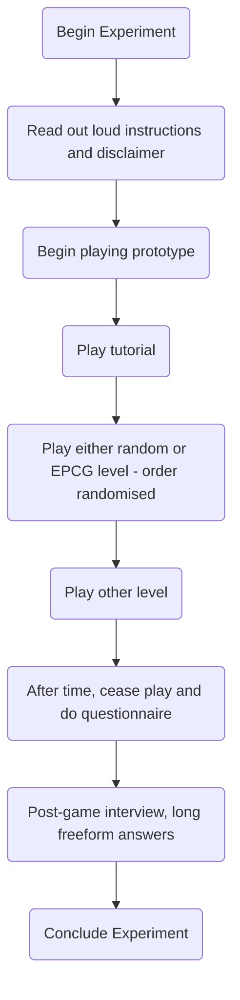

## Tuesday 27th June, 2023

- [ ] Create a rough experimental design for my masters
	- [x] Decide on face to face / online async / hybrid overall design
	- [ ] Decide what results I am looking for, what I am trying to prove by this experiment
	- [ ] From ^, draw metrics that can be recorded either automatically or from participants' feedback
	- [ ] Write a brief overview of the final experiment, using a scientific experiment template
- [ ] (IF TIME) Begin work on some metric tracking system in the prototype, in response to the decided metrics to track
---

### Experimental Design
- I am testing to see if the implemented EPCG system successfully increases enjoyment, engagement, interest and immersion in direct comparison to random weapon generation
- In this case, as I will be looking for mainly subjective results, **a face to face experiment would be most appropriate**. This is mainly due to the inherent objectivity derived from online testing resulting in mainly quantitative feedback
- I am looking to compare two gameplay experiences: random generation and my bespoke EPCG generation. 
- Digital recreation of the Game Experience Questionnaire Core Module: https://forms.gle/5uHerW5XzhncNMKz9

- Could alter this so that the participant completes the questionnaire after each level - i.e. after they play the randomised gen and after they play the EPCG gen
---

### Prototype Development
- Need to incentivise the players to kill the robots, i.e. to give intrinsic desire to complete the gameplay loop
	- Could do this by making the robots sometimes drop weapons, giving incentive to kill robots through looping it back into the main mechanic of the game - the weapons
- One big problem that needs to be addressed is fostering the excitement around trying new weapon combinations
	- Could be done by making the weapons themselves more exciting
	- **Could reduce the amount of possible modifiers on a weapon to 2-3 so that they are easier to conceptualise**
		- Fewer modifiers on the weapons results in longer time to discover all modifiers