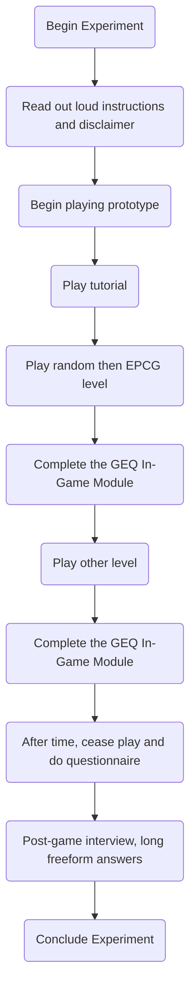

# To Dos

## Tuesday 27th June, 2023

- [ ] Create a rough experimental design for my masters
	- [x] Decide on face to face / online async / hybrid overall design
	- [x] Decide what results I am looking for, what I am trying to prove by this experiment
	- [x] From ^, draw metrics that can be recorded either automatically or from participants' feedback
	- [ ] Write a brief overview of the final experiment, using a scientific experiment template
- [x] (IF TIME) Begin work on some metric tracking system in the prototype, in response to the decided metrics to track

## Wednesday 28th June, 2023
- [x] Develop some more metrics to be tracked and therefore examined at a later date
- [x] Decide on whether or not to use in-game questionnaire between play sessions to get a more granular perspective of the random vs. EPCG gen
- [ ] Implement the selection of generation techniques in the game:
	- [ ] Have two portals from the Lab to the Sandbox?
	- [ ] Have a lever/switch in the Lab that flips between the generation techniques
---
# Notes

### Experimental Design
- I am testing to see if the implemented EPCG system successfully increases enjoyment, engagement, interest and immersion in direct comparison to random weapon generation
- In this case, as I will be looking for mainly subjective results, **a face to face experiment would be most appropriate**. This is mainly due to the inherent objectivity derived from online testing resulting in mainly quantitative feedback
- I am looking to compare two gameplay experiences: random generation and my bespoke EPCG generation. 
- Digital recreation of the Game Experience Questionnaire Core Module: https://forms.gle/5uHerW5XzhncNMKz9
- **Assign each participant an ID, to be labelled to all files associated with that participant**

#### Metrics
- Automatically Recorded:
	- Play session ID
	- Participant ID
	- Session start time
	- Session end time
	- Death count
	- Enemy kill count
	- Waves completed
	- Total different weapons found
	- Gen Alg used (either random or EPCG)
- Feedback Recorded:
	- Semi-Structured Interview
	- Game Experience Questionnaire Core Module: https://forms.gle/5uHerW5XzhncNMKz9
		- To give a general feedback on the game as a whole
	- Game Experience Questionnaire In-Game Module:
		- To give a point of difference between the different generation parameters
	- Combined with some bespoke questions??
		- Did you notice a difference between the two gameplay states? If so, what was it?
		- Did you prefer the first playthrough or the second? (Referring to the different gameplay states)
		- What was your favourite, or most memorable, weapon combination? What made it so fun?
		- Any advice for changes to be made to the prototype if it continued development?
![[Pasted image 20230627140941.png]]
---

### Prototype Development
- Need to incentivise the players to kill the robots, i.e. to give intrinsic desire to complete the gameplay loop
	- Could do this by making the robots sometimes drop weapons, giving incentive to kill robots through looping it back into the main mechanic of the game - the weapons
	- Add satisfying SFX to make the entire gameplay loop more rewarding
- One big problem that needs to be addressed is fostering the excitement around trying new weapon combinations
	- Could be done by making the weapons themselves more exciting
	- **Could reduce the amount of possible modifiers on a weapon to 2-3 so that they are easier to conceptualise**
		- Fewer modifiers on the weapons results in longer time to discover all modifiers